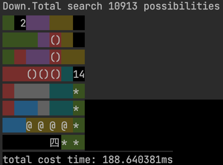
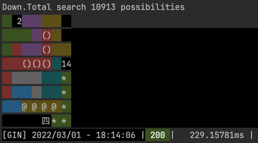
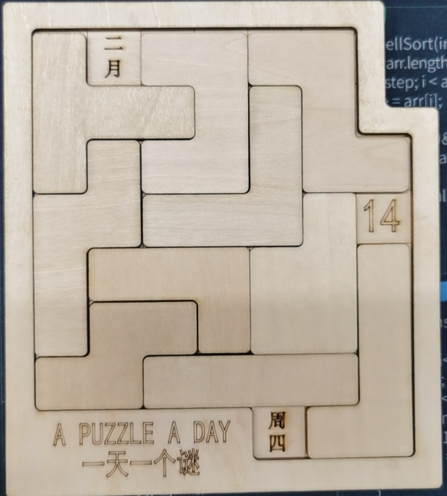

# calender puzzle

日历拼图游戏是一款益智游戏，可以在一块板上拼出365天每天的日历，进阶玩法中还带有星期，难度更上一层楼。


## 一、日历拼图游戏
* 本项目使用Go语言开发，主要思想参考自[c++代码](https://github.com/wangkuahai/calendar_puzzle )，感谢大佬。
* 我在大佬的代码基础上加了进阶玩法，带星期。并使用dfs剪枝优化了算法。
* 除了在本地运行，还可以启用一个http-server，方便远程调用。

## 二、快速运行
```bash
# 参数说明
 -mode string
        running mode, server or local (default "server")
 -port string
        port when use server (default "8888")
 -show string
        show pic in log when use mode server (default "true")
```

### 1 本地运行
```bash
# 本地二进制运行
$ ./bin/puzzle-mac --mode=local
# 或者代码运行
$ go run main.go --mode=local

# 控制台输出
--> 输入【help】打印此提示
--> 输入【exit】退出程序
--> 输入【月 日】查看简单日历拼图答案
--> 输入【月 日 周】查看困难日历拼图答案
--> 如：【2月14日星期四】输入：2 14 四
=====================================

# 输入 2 14 四
$ 2 14 四
```



> **说明**: 如果是简单玩法，不带星期的，只需要传月和日即可，即：2 14

### 2 运行http服务
```bash
# 启动http服务
$ ./bin/puzzle-mac --mode=server --show=true --port=8888
# 或者代码运行
$ go run main.go --mode=server --show=true --port=8888

# 控制台输出
[GIN-debug] GET    /resolve                  --> sign/puzzle/server.resolve (3 handlers)
[GIN-debug] GET    /getMap                   --> sign/puzzle/server.getMap (3 handlers)
[GIN-debug] Listening and serving HTTP on :8888
```
Get 访问 localhost:8888/resolve?month=2&day=14&week=四



> **说明**: 如果是简单玩法，不带星期的，只需要传月和日即可，即：?month=2&day=14

以下是根据代码运行结果实际拼出来的图



---
### 关于作者：

作者：`LeoNumber1(Yuan Li)`

`mail`:
[leo.vip@foxmail.com](mailto:leo.vip@foxmail.com)

`github`:
[https://github.com/LeoNumber1](https://github.com/LeoNumber1)